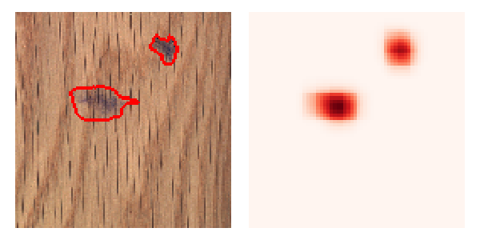

# Patch SVDD
Patch SVDD for Image anomaly detection. Paper: https://arxiv.org/abs/2006.16067 (published in ACCV 2020).

An input image and a generated anomaly map for 'wood' class.



# Compatibility

The code runs on python 3.7, pytorch 1.3.1, and torchvision 0.4.2.
 

# Installation


#### Step 1. Install libraries.
- Install [required libraries](requirements.txt).

#### Step 2. Download MVTec AD dataset.
- Download MVTec AD dataset: [Download](https://www.mvtec.com/company/research/datasets/mvtec-ad/)
- Untar the 'mvtec_anomaly_detection.tar.xz' file.


# Code examples

#### Step 1. Set the *DATASET_PATH* variable.

Set the [DATASET_PATH](codes/mvtecad.py#L008) to the root path of the downloaded MVTec AD dataset.

#### Step 2. Train **Patch SVDD**.

```bash
python main_train.py --obj=bottle --lr=1e-4 --lambda_value=1e-3 --D=64
```

- `obj` denotes the name of the class out of 15 MVTec AD classes.
- `lr` denotes the learning rate of Adam optimizer.
- `lambda_value` denotes the value of 'lambda' in Eq. 6 of the paper.
- `D` denotes the number of embedding dimension (default to 64). 


#### Step 3. Evaluate the trained encoder.

```bash
python main_evaluate.py --obj=bottle
```

- `obj` denotes the name of the class.

The script loads the trained encoder saved in ckpts/ directory.
Note that the same evaluation procedure is performed at every training epoch in Step 2.

For a quick evaluation, trained encoders for *cable* and *wood* classes are included.
Training (Step 2) can be skipped for those classes.

#### Step 4. Obtain anomaly maps.


```bash
python main_visualize.py --obj=bottle
```

- `obj` denotes the name of the class.

The script generates and saves anomaly maps for all the test images in the `obj` class.
The genereated maps are saved in anomaly_maps/*obj* directory.
